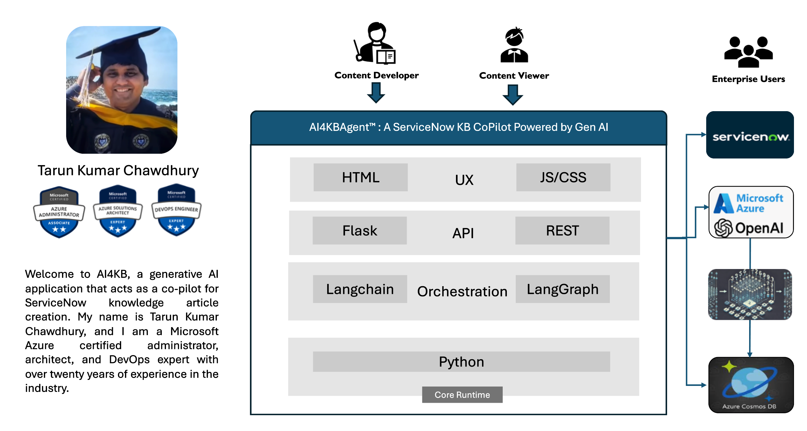
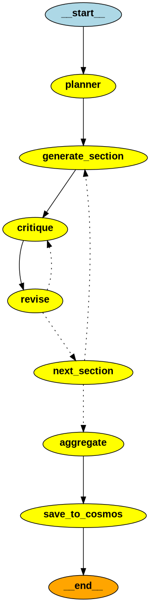

# AI4KBAgent™: A ServiceNow KB CoPilot Powered by Gen AI

## Overview
AI4KBAgent™ is a generative AI application that acts as a co-pilot for creating ServiceNow knowledge articles. This project leverages advanced AI technologies to automate and enhance the process of generating high-quality KB articles, ensuring efficiency and accuracy. 

## Table of Contents
- [Inspiration](#inspiration)
- [What It Does](#what-it-does)
- [How We Built It](#how-we-built-it)
- [Challenges We Ran Into](#challenges-we-ran-into)
- [Accomplishments That We're Proud Of](#accomplishments-that-were-proud-of)
- [What We Learned](#what-we-learned)
- [What's Next for AI4KBAgent™ CoPilot](#whats-next-for-ai4kbagent-copilot)
- [Technical Architecture](#technical-architecture)
- [Development and Deployment](#development-and-deployment)
- [Images](#images)

## Inspiration
The inspiration for AI4KBAgent™ CoPilot came from the need to enhance enterprise knowledge management systems with the power of AI. Most enterprise service management systems use ServiceNow KB articles as the primary source of guidance for all employees and contractors. With Generative AI, we have the opportunity to augment the quality of KB articles and deliver them faster. However, KB content management presents a separate problem that requires a dedicated application to integrate with Generative AI and manage article content independently, delivering it to ServiceNow when appropriate. This app, ServiceNow CoPilot, is designed to meet this need.

## What It Does
AI4KBAgent™ CoPilot uses AI to refine KB articles based on user inputs. Content developers can submit a title and any extra information they want to include. The app then creates the document using a multi-step agentic approach. It starts by planning the article, creating a title, summary, category, and sections with high-level content. Then, iteratively for each section, it generates content and sends it to a critique agent. Based on the critique feedback, it revises the content. This loop can be configured; currently, it is set for three iterations. Once all sections are completed in this manner, it aggregates and saves the draft in CosmosDB. The user can further edit and set the state to approved or published. If approved, it becomes visible to content viewers in the app. If published, it triggers a ServiceNow API call to create a KB article and notifies teams via Microsoft Teams and email.

## How We Built It
We built AI4KBAgent™ CoPilot by integrating several technologies:
1. **Azure OpenAI API:** To generate and refine content based on user input.
2. **LangChain and LangGraph:** To create an AI agent flow that plans and structures the article content.
3. **ServiceNow API:** To create and manage KB articles in ServiceNow.
4. **Azure CosmosDB:** To store and retrieve existing KB articles using vector search.
5. **Web Application:** A user-friendly interface developed using a modern web framework to interact with the AI and manage KB articles.

## Challenges We Ran Into
One of the significant challenges was ensuring the AI-generated content met the quality standards for KB articles. We had to fine-tune the prompts iteratively, using self-reflection and review processes to achieve the desired output. Additionally, we faced challenges implementing Vector Search with CosmosDB NoSQL, as described in this [article](https://learn.microsoft.com/en-us/azure/cosmos-db/nosql/vector-search). Specifically, we encountered intermittent errors while creating and updating the Vector Policy. Although the policy saved successfully at one point, enabling vector search, subsequent steps resulted in errors. Therefore, we resorted to using standard CosmosDB queries and in-memory logic to identify relevant articles. We checked titles and summaries during article chat or question-answer sessions, and then used the full article for in-context learning. This approach worked well for smaller articles, providing accurate results. However, as articles grow in size, we plan to move to vector-based search using DiskANN for better performance. Integrating multiple APIs seamlessly and ensuring data consistency across platforms was another challenge.

## Accomplishments That We're Proud Of
We are proud of successfully integrating AI to create high-quality KB articles that meet user needs. The implementation of vector search in CosmosDB to suggest existing articles is a significant achievement. Our user-friendly web interface ensures a smooth and efficient experience for users. The real win is our successful integration with ServiceNow, allowing us to publish KB articles directly to ServiceNow, expanding the reach across the enterprise and making a meaningful impact. After an article is created, reviewed, and approved in the app, it is published in ServiceNow as a KB knowledge article. This triggers notifications via Microsoft Teams and email, providing the ServiceNow KB URL link for users to read and provide feedback.

## What We Learned
Through this project, we learned the importance of balancing AI automation with human oversight to ensure content quality. We gained valuable experience in integrating multiple APIs and managing data across different platforms. Additionally, we learned how to optimize vector search to improve the relevance of suggestions. Although we faced challenges with CosmosDB's vector search feature, we found effective alternatives using standard queries and in-memory logic for smaller articles. Cosmos DB proved to be especially effective in AI chat, particularly in retrieval-augmented generation (RAG), and its preview vector search feature with DiskANN is a game-changer that we plan to explore further in the future【source】.

## What's Next for AI4KBAgent™ CoPilot
The next steps for AI4KBAgent™ CoPilot include:
1. Enhancing the AI model to better understand user input and generate more accurate content.
2. Improving the vector search algorithm in CosmosDB for even more relevant suggestions.
3. Adding more features to the web interface, such as advanced search filters and analytics to track KB article usage and effectiveness.
4. Expanding integration with other knowledge management systems to broaden the tool's applicability.
5. Implementing Graph RAG for better question-answer functionality.
6. Scaling the app from a single container in Azure Container Instance to save costs, with future plans for larger scale deployment.
7. Integrating with other systems like Slack or SharePoint to enhance enterprise connectivity.
8. Checking first if a relevant article exists and suggesting it to the user before creating a new one, allowing the user to proceed only if they still want to create a new entry.

For more details on CosmosDB’s vector search capabilities, check out this [YouTube link](https://www.youtube.com/watch?v=MlMPIYONvfQ).

## Technical Architecture

## Development and Deployment
We developed the AI4KBAgent™ application as a Docker container. The development process included local testing, followed by pushing the container to Azure Container Registry (ACR) and deploying it to Azure Container Instance. The technology stack includes:

- **Azure OpenAI**
- **ServiceNow API**
- **Azure CosmosDB NoSQL**
- **Python**
- **Flask**
- **LangChain**
- **LangGraph**

## Images
### LangGraph Flow

